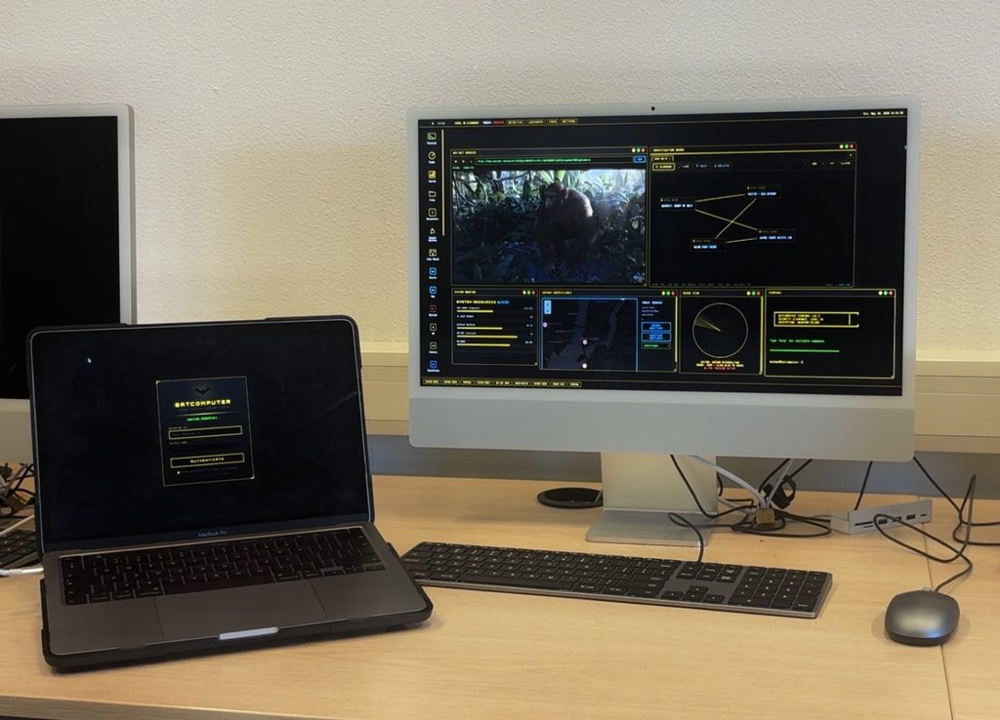
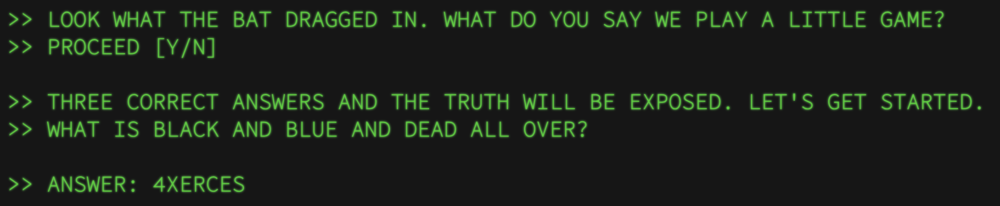

# batcomputerglr
Casper, Jeremy en Alex AKA Meteorstrike. (doomfist mention?)

<h1>Overview + Usage </h1>

Make sure you're in the batcomputer directory and that node is installed ( npm install ). Once that's completed run ' npm run dev ' inside. Username is "Bruce" and the password is "Gotham". I want to end up with a .exe file but until we are finished, node will handle everything. We messed around a lot with iframes, revamp might happen soon enough.

This is supposed to be an OS emulator based off the batcomputer from the famous batman comics. We have taken a lot of inspiration from the batman arkham games, let's not sue anyone DC! It  has tons of features ranging from a built in web browser to a investigation board. Once this project has finished we'll note everything down here. It has customisable themes for different colors. Color names are based off the arkham origin games specifically but names will be changed soon. As of right now there's some bits of lore to it but it's unfinished, once finished we want to add a ARG like story game. Due to this please do not mind the random notifications :D. 

<h1> Tue 26 May </h1>

slight sneak peak, i'll have to upload everything soon enough.

<h1>Wed 27 May </h1>

So we have uploaded the prototype, it's not fully finished till the liking of our desire. 

<h1>Fri 29 May </h1>

So we tested using the application on other devices (school mac and casper my king's laptop). We took this cool picture!

<h1>Fri Jun 5</h1>

So we pitched our progress the past week and we found out that we are closer than we thought. We worked through our concepts for the lore and settled on an idea.   

Here's a sneak peek  
  

<h1> RELEASE </h1>

After trial and error and screwing around with the dist we managed to finish it well within time!! :D    All credits to Casper, Jeremy and Alex. We are AMAZING. 

<h3> Future... </h3>

- Villain index more written out. 
- Voice control working on app version too
- Clearance lore
- Cleaning up JS
- Proper 3D Models
- Maybe implement react

<h2>TL;DR: BUGS WILL BE FOUND, THIS IS IN ALPHA PHASE</h2>

Also we decided to remove react completely. We only used it for some niche parts and figured since our use of it is so limited we might as well just remove it completely.

